# lossless-compaction

[](https://github.com/yottayoshida/lossless-compaction/actions/workflows/ci.yml)

> A Claude Code plugin that compacts a conversation without summarizing it: old tool results move to files on your machine, and the agent reads any of them back, exact, by id.

Claude Code's `/compact` asks a model for a summary: tens of seconds of
waiting, a request the size of the conversation, and the summary in place of
what was said. This plugin moves old tool results out instead, leaving a
one-line ticket for each. That takes a fraction of a second and calls no
model, and what you and the agent said stays word for word. The price is a
larger conversation afterwards. It works where tool results fill the
conversation: files read, logs, command output ([limits](docs/limits.md)).

## Demo



The 61 ms is the plugin's own count for one recorded compaction
([how it was taken](docs/measurements.md)); no model is called, so it goes
with the conversation's size, not the model.

## Quick start

```sh
claude plugin marketplace add yottayoshida/lossless-compaction
claude plugin install lossless-compaction@lossless-compaction
```

Then turn Claude Code's function hooks on, once, in the `env` of
`~/.claude/settings.json`:

```json
{ "env": { "CLAUDE_CODE_ENABLE_FUNCTION_HOOKS": "1" } }
```

Start a new session. `/compact` and automatic compaction now go through the
plugin, and each says what it did in a line marked `lossless-compaction:`.
Function hooks are early access: with them off the plugin moves nothing out,
and tells you so at your first message
([other ways to set it up](docs/limits.md#setting-it-up)).

## What it does

- **Compacts without a summary.** Each result is written to a file named by
  the SHA-256 of its content and read back before a ticket replaces it.
  Rules decide what leaves; nothing is sent anywhere
  ([how it works](docs/how-it-works.md)).
- **Gives a result back as it was.** The agent calls `recall` with the id on
  a ticket. With a key for [Jev](https://typesafe.ai), a model reached
  through TypeSafe AI or Cloudflare, it can also ask in words with `find`,
  and Jev picks the result ([usage](docs/usage.md)).
- **Saves the conversation before a summary.** When Claude Code's summary
  does run, the plugin keeps what it replaces first, for `recall` to read:
  not images, documents or thinking
  ([what is kept](docs/limits.md#what-a-summary-replaces)).

## Against the built-in compaction

Two made-up conversations of the kind the plugin compacts, measured once
with Opus 5.5, each question asked of a fresh copy of what `/compact` left:

|                                               |         Plugin |     Built-in |
| --------------------------------------------- | -------------: | -----------: |
| **102,276 tokens, mostly large tool results** |                |              |
| `/compact` took                               |         0.10 s |       23.2 s |
| `/compact` cost                               |        nothing |     0.51 USD |
| The next request carried                      |  43,884 tokens | 6,952 tokens |
| With nine questions: time                     |         42.5 s |       72.0 s |
| With nine questions: cost                     |       0.62 USD |     0.68 USD |
| **575,632 tokens, in a window of 1,000,000**  |                |              |
| `/compact` took                               |         0.35 s |       51.4 s |
| `/compact` cost                               |        nothing |     2.93 USD |
| The next request carried                      | 272,428 tokens | 6,538 tokens |
| With eleven questions: time                   |         82.8 s |      105.3 s |
| With eleven questions: cost                   |       3.58 USD |     3.13 USD |

- **`/compact` is instant and free, and every request after it is larger.**
  In the larger conversation its questions took longer, and cost more than
  the summary and the questions after it.
- **In one run of each model, the answers were no better with the plugin.**
  After a summary, Sonnet 5.5 and Opus 5.5 answered from Claude Code's own
  record of the session. Sonnet answered 9 of 9 either way. Opus had 8 of 12
  exact answers counted right with the plugin and 10 without; the others
  held the right line with an id written the way a rule of the conversation
  asks
  ([every table](docs/measurements.md#with-opus-55-and-in-a-window-of-1000000)).

## Before you install

- **A `/compact` you type can do nothing.** With nothing to move out and
  room left, it says so and changes nothing. `/compact` with instructions
  still summarizes.
- **Results are kept as plain files** under `~/.claude/lossless-compaction/`
  while a recorded conversation names them, with no limit on how much. A
  secret in a tool result stays there with them.
- **`find` sends excerpts of the conversation** to the Jev provider you
  choose, from every repository once a key is set. A compaction and `recall`
  send nothing.

## Docs

- [Usage](docs/usage.md) — what a compaction prints, `recall`, what `find` sends
- [How it works](docs/how-it-works.md) — what is stored, what leaves, what is deleted
- [Limits](docs/limits.md) — when the summary still runs, what is not kept, setup
- [The comparison measured with Haiku 4.5](docs/comparison.md), and every [measurement](docs/measurements.md)
- [Development](docs/development.md), [CHANGELOG](CHANGELOG.md), [settings](.claude-plugin/plugin.json) and [decision records](docs/adr/)

The idea comes from
[fast-jev-compaction](https://github.com/tamaratran/fast-jev-compaction),
with which this shares no code. Not affiliated with TypeSafe AI or Anthropic.

## License

Licensed under either of [Apache License, Version 2.0](LICENSE-APACHE) or
[MIT license](LICENSE-MIT) at your option.
